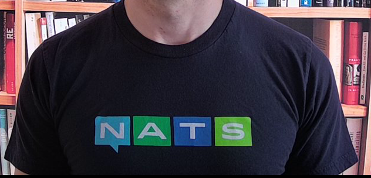

## ideas of the day

- Since I'm wearing my [NATS](https://nats.io/)  t-shirt:    

   

  I'd like to write some code that uses NATS. That's enough motivation, isn't it?  

## Today I leanred (TIL)
  
  I can use html img tag in my markdown. Wasn't it obvoius?

 
 
 

### Update:

I did the first iteration for the NATS code with a simple pause/resume publishing
[here](https://github.com/abtin/gonats). 

